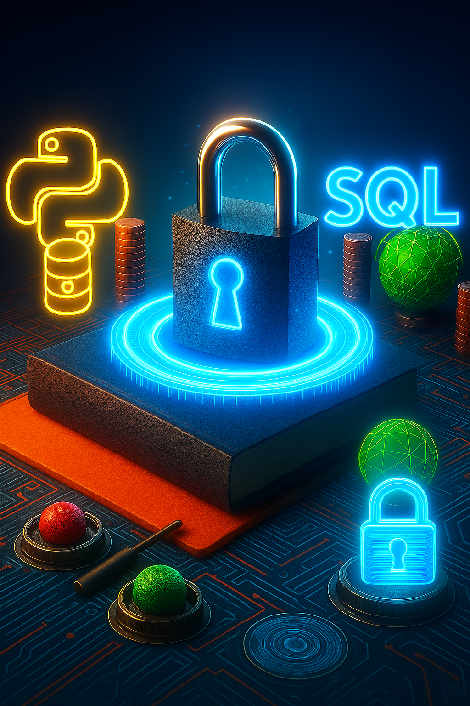

<table>
  <tr>
    <td align="left" width="50%">
      <h1>👋 Hi, I'm Gerard — Future Full Stack Developer</h1>
      

        I’m currently on a journey to become a full stack developer, learning by doing, building real projects,
        and sharing my growth along the way. I’m passionate about solving problems with code, and lately I’ve
        started diving into the world of <strong>cybersecurity</strong> — especially <strong>Python automation</strong>, <strong>SQL</strong>, and <strong>system defense</strong>.  
        My goal is not just to code, but to understand how technology can protect and empower people.
      

      

        🧠 About Me:

- 🧩 I believe that programming is a tool for thinking, not just building.
- 🎯 I'm focused on deep learning, not shortcuts — each project is a step in my evolution.
- 📚 I document not just what I create, but how and why I created it.
- 🌍 I speak 5 languages fluently - passioned by geography - curious by nature, I thrive in international and creative environments.
- 🛡️ I'm currently expanding into cybersecurity, driven by curiosity and the desire to understand how systems stay secure.

I'm not here just to code — I'm here to **understand, grow, and build meaningful digital experiences**.
      

    </td>
    <td align="right" width="50%">
      
    </td>
  </tr>
</table>

# Who am I? Get to know me!

> 🚧 **This README is a work in progress!** Stay tuned as I continue to improve it.

---

## 🧠 About Me

- 🧩 I believe that programming is a tool for thinking, not just building.
- 🎯 I'm focused on deep learning, not shortcuts — each project is a step in my evolution.
- 📚 I document not just what I create, but how and why I created it.
- 🌍 I speak 5 languages fluently - passioned by geography - curious by nature, I thrive in international and creative environments.
- 🛡️ I'm currently expanding into cybersecurity, driven by curiosity and the desire to understand how systems stay secure.

I'm not here just to code — I'm here to **understand, grow, and build meaningful digital experiences**.

---

## 🚀 My Vision

My GitHub Portfolio isn’t just a showcase — it’s a learning journal. I am currently a student, so I'm including most of my learning projects here to track my learning process with the dates of when I made them.

I am also posting repositories with my lessons, theory and notes taken, cleaned up and organized into markdown files, with most of the exercises that I'm doing to help other students grasp this knowledge. For now these repositories are private as I'm building them but hit me up if you want to have access.

As part of this process, I recently began exploring cybersecurity as a complementary skillset. I'm treating this just like I did with coding: by building a home-lab, taking structured courses, and documenting everything I'm learning in public repositories.

Each repository with a learning project includes:
- 🧪 What I experimented with
- 🧱 What I built and how
- 💡 What I learned and improved
- 🔁 Which challenges I encountered and how I pushed through

I want my portfolio to reflect not just my skills, but my journey, my mindset, and the kind of developer I’m becoming.

---

## 🛠️ Skills in Progress
>  **Adding more skills and languages as I make gradual progress in the programming world**

- **Known tools**: Python, HTML, Flask, learning CSS, Javascript and Cybersecurity right now 📚 
- **Mindset**: Resilient, Curious, Independent & Self-aware

I’m currently expanding into full-stack frameworks, system design, and interface development.

---

## 🔗 Let’s Connect
>  **This part has to be updated with my info!**

I'm always open to collaboration, feedback, or a good tech conversation.

If you’re a mentor, recruiter, fellow learner, or just curious — feel free to reach out or explore my projects. I'm here to build, learn, and contribute.

Thanks for stopping by!

>  **This following block is about the future suggestions**
---

📝 Suggestions for Further Improvement

> 🧪 *These are notes for myself to improve this README and portfolio over time. This section is private for now, but will help guide the evolution of this page.*

- **Fill in Real Links:**  
  Replace the placeholder links (LinkedIn, Portfolio, email, project URLs) with my actual URLs when I'm ready.

- **Project Details:**  
  Add one-sentence summaries for each project, focusing on what makes them interesting or what I learned.

- **Skill Level Indicators:**  
  Use emojis, badges, or plain text to indicate my current level of comfort or proficiency with each skill.

- **Visuals:**  
  Include a profile picture, banner, or project screenshots to make the page more visually engaging.

- **Keep It Updated:**  
  As I complete new projects or learn new technologies, update this README to reflect my growth.

- **Feature my best projects:**  
  Showcase the handful of projects that I am most proud of.
---

