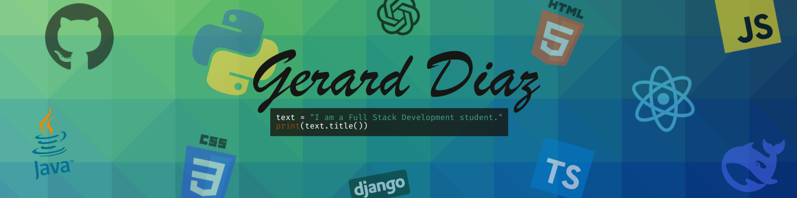

  

# Who am I? Get to know me!

> 🚧 **This README is a work in progress!** Stay tuned as I continue to improve it.

---

# 👋 Hi, I'm Gerard — Future Full Stack Developer

I'm currently on a journey to become a full stack developer, learning by doing, building real projects, and sharing my growth along the way. I’m passionate about solving problems with code and committed to mastering both front-end and back-end development.

---

## 🧠 About Me

- 🧩 I believe that programming is a tool for thinking, not just building.
- 🎯 I'm focused on deep learning, not shortcuts — each project is a step in my evolution.
- 📚 I document not just what I create, but how and why I created it.
- 🌍 Multilingual and curious by nature, I thrive in international, creative environments.

I'm not here just to code — I'm here to **understand, grow, and build meaningful digital experiences**.

---

## 🚀 My Vision

My GitHub isn’t just a showcase — it’s a learning journal.

Each repository includes:
- 🧪 What I experimented with
- 🧱 What I built and how
- 💡 What I learned and improved
- 🔁 Which challenges I encountered and how I pushed through

I want my portfolio to reflect not just my skills, but my journey, my mindset, and the kind of developer I’m becoming.

---

## 🛠️ Skills in Progress

- **Languages**: Python✅, HTML, CSS, JavaScript  
- **Concepts**: Algorithms✅, Data Handling✅, Web Development, Automation  
- **Mindset**: Resilient, Curious, Self-taught & Self-aware

I’m currently expanding into full-stack frameworks, system design, and interface development.

---

## 🔗 Let’s Connect
>  **This part has to be updated with my info!**

I'm always open to collaboration, feedback, or a good tech conversation.

If you’re a mentor, recruiter, fellow learner, or just curious — feel free to reach out or explore my projects. I'm here to build, learn, and contribute.

Thanks for stopping by!

>  **This following block is about the future suggestions**
---

📝 Suggestions for Further Improvement

> 🧪 *These are notes for myself to improve this README and portfolio over time. This section is private for now, but will help guide the evolution of this page.*

- **Fill in Real Links:**  
  Replace the placeholder links (LinkedIn, Portfolio, email, project URLs) with my actual URLs when I'm ready.

- **Project Details:**  
  Add one-sentence summaries for each project, focusing on what makes them interesting or what I learned.

- **Skill Level Indicators:**  
  Use emojis, badges, or plain text to indicate my current level of comfort or proficiency with each skill.

- **Visuals:**  
  Include a profile picture, banner, or project screenshots to make the page more visually engaging.

- **Keep It Updated:**  
  As I complete new projects or learn new technologies, update this README to reflect my growth.

- **Feature my best projects:**  
  Showcase the handful of projects that I am most proud of.
---

